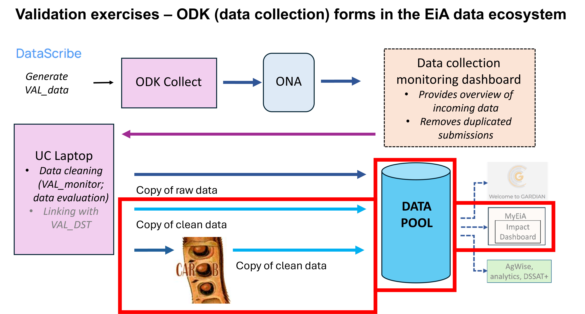

\newpage 
\pagenumbering{arabic}
\tableofcontents
\newpage


```{r setup, include=FALSE}
knitr::opts_chunk$set(tidy = TRUE, warning=FALSE, comment = NA)


```

# Introduction
The analytics guidelines document is designed to offer a understanding of diverse analytics methodologies, data preparation techniques, and the visualization of validation data. It equips users with the knowledge and tools/ parameters needed to derive meaningful insights from their data and effectively measure Agronomic gain key performance indicators (KPIs), which are designed to monitor, evaluate and measure the impact of changes in agronomic practices in the CGIAR Excellence in Agronomy initiative (EiA).

The use case is expected to run the analysis parallel to ascertain the validity of the data provided.


The KPI documentation (Saito et al., 2021) is accessible via this link: https://cgspace.cgiar.org/items/624c2bf3-6887-4036-b46f-19bb6f223705. The KPI guide provides a description of various KPIs and how to calculate them. They cover land productivity and its stability, resource use efficiency and soil health and are used across geographies, farming systems, and research and development (R&D) stages (like validation and piloting stages) (Saito et al., 2021)


The graphic below shows the various stages of the data flow during validation exercise. The highlighted section (in red) is what will be highlighted in detail in this analytics document.

```{r intropic ,out.width="100%", echo=FALSE, fig.cap="Validation exercises - ODK (data collection) forms) in the EiA data ecosystem"}


```

# Validation Analysis

Use Cases must perform a validation exercise to test the benefits of their Minimum Viable Product (MVP). For more information on the protocol for validation exercises see Kreye et al., 2023. 

The following is required before any analysis and visualization can be performed on the validation data.

## Data Cleaning
The use case team performs data cleaning calculates required standard parameters.


## Organising data 
Different KPIs require different variables and are explained in the table below with their description and required units. These variables can be generated from the validation data.


### KPI Parameters

List of main KPIs considered in EiA Use Cases: 

Yield, Yield stability, Profit, Nutrient-use efficiency, NUE for N, NUE for P, NUE for K, Water productivity, Labor productivity, Soil organic carbon, yield-scaled GHGs, Product quality. (Kreye et al., 2023).

Below are required parameters for different KPI calculations (Saito et al., 2021).


```{r table-kpipar, echo=FALSE, warning=FALSE, message=FALSE,comment = NA }
kpipar <- read.csv("./samples/sampledata/var_desc.csv")
kpipar <- as.data.frame(kpipar)
names(kpipar) <- gsub("\\.", " ", names(kpipar))
knitr::kable(kpipar, caption = "Table of Required KPI Variables")

```

### Calculate KPIs
Different use cases measure different KPIs.

According to the KPIs of interest one can easily calculate KPI values as described by (Saito et al., 2021).

The R function below can help to easily achieve this with the right parameters (ref for R function?).

(***names of the various variables in the function need to be updated with standard names as discussed in previous meeting...)

```{r kpi-fun }
KPI <- function(df) {
  # The objective of this KPI function version 1.0 (28/8/23) is to compute different Agronomic gain
  # key performance indicators (KPIs) in on-farm trials.
  # The function compute each KPI based on the available data in the data frame.
  # The input data frame should be organized similar to the dummy data frame, columns
  # 'UseCase' and 'HHID' , "treat" MUST be included and the rest are input variables that are in standardized format.
  
  suppressWarnings(suppressPackageStartupMessages(library(tidyverse)))
  
  name.df <- deparse(substitute(df))
  
  end <- function() { 
    invokeRestart("abort") 
    }   
  
  if (!exists(paste0("",name.df,""))) {
    print("Please supply a valid dataset")
    end()
  }
  if (any(!class(df) %in% c("tbl_df","tbl","data.frame"))) {
    print("Please supply a valid dataset")
    end()
  }
  if (ncol(df)==0|nrow(df)==0) {
    print("Please supply a valid dataset")
    end()
  }
  if (!"UseCase" %in% names (df)) {
    print("Please add a column of the Use Cases with the name UseCase")
    end()
  }
  if (!"HHID" %in% names (df)) {
    print("Please add a column of the Household identification number with the name HHID")
    end()
  }
  if (!"tret" %in% names (df)) {
    print("Please add a column of the treatment  with the name treat")
    end()
  }
  
  #1 - Primary product harvested yield
  PPHY <- function(X, Y) {
    if(!is.null(X) & !is.null(Y)) {
      if(!is.na(X) & !is.na(Y)){
        if(is.numeric(X) & is.numeric(Y)) {
          if(Y!=0){
            X/(Y)
          } else {
            NA
          }
        }
        else {
          NA
        }
      }
      else {
        NA
      }
    } else {
      NA
    }
  }
  
  #2 - Secondary product harvested yield
  SPHY <- function(X, Y) {
    if(!is.null(X) & !is.null(Y)) {
      if(!is.na(X) & !is.na(Y)){
        if(is.numeric(X) & is.numeric(Y)) {
          if(Y!=0){
            X/(Y)
          } else {
            NA
          }
        }
        else {
          NA
        }
      }
      else {
        NA
      }
    } else {
      NA
    }
  }
  
  #3 - Sustainable yield index
  SYI <- function(X, Y, Z) {
    if(!is.null(X) & !is.null(Y) & !is.null(Z)) {
      if(!is.na(X) & !is.na(Y) & !is.na(Z)){
        if(is.numeric(X) & is.numeric(Y) & is.numeric(Z)) {
          if(Z!=0){
            (X - Y)/(Z)
          } else {
            NA
          }
        }
        else {
          NA
        }
      }
      else {
        NA
      }
    } else {
      NA
    }
  }
  
  #4 - Cost-benefit balance
  CBB <- function(X, Y) {
    if(!is.null(X) & !is.null(Y)) {
      if(!is.na(X) & !is.na(Y)){
        if(is.numeric(X) & is.numeric(Y)) {
            X - Y
          } else {
            NA
          }
        }
        else {
          NA
        }
      }
      else {
        NA
      }
  }
  
  #5 - Gross revenue
  GR <- function(W, X, Y, Z) {
    if(!is.null(W) & !is.null(X) & !is.null(Y) & !is.null(Z)) {
      if(!is.na(W) & !is.na(X) & !is.na(Y) & !is.na(Z)){
        if(is.numeric(W) & is.numeric(X) & is.numeric(Y) & is.numeric(Z)) {
          (W*X) + (Y*Z)
        } else {
          NA
        }
      }
      else {
        NA
      }
    }
    else {
      NA
    }
  }  
  
  #6 - Agronomic gain in cost-benefit balance
  AGCB <- function(X, Y, Z) {
    if(!is.null(X) & !is.null(Y) & !is.null(Z)) {
      if(!is.na(X) & !is.na(Y) & !is.na(Z)){
        if(is.numeric(X) & is.numeric(Y) & is.numeric(Z)) {
          (X*Y) - Z
        } else {
          NA
        }
      }
      else {
        NA
      }
    }
    else {
      NA
    }
  }  
 
  #7 - Partial factor productivity of applied Nitrogen 
  PFPN <- function(X, Y, Z) {
    if(!is.null(X) & !is.null(Y) & !is.null(Z)) {
      if(!is.na(X) & !is.na(Y) & !is.na(Z)){
        if(is.numeric(X) & is.numeric(Y) & is.numeric(Z)) {
          if((Y+Z)!=0){
            X/(Y + Z)
          } else {
            NA
          }
        }
        else {
          NA
        }
      }
      else {
        NA
      }
    } else {
      NA
    }
  }
  
  #8 - Nutrient-use efficiency
      #Nitrogen-use efficiency
  NUE <- function(W,X, Y, Z) {
    if(!is.null(X) & !is.null(Y) & !is.null(Z)) {
      if(!is.na(X) & !is.na(Y) & !is.na(Z)){
        if(is.numeric(X) & is.numeric(Y) & is.numeric(Z)) {
          if((Y+Z)!=0){
            (W*X)/(Y + Z)
          } else {
            NA
          }
        }
        else {
          NA
        }
      }
      else {
        NA
      }
    } else {
      NA
    }
  }
  
    # Phosphorous-use efficiency
  PUE <- function(W,X, Y, Z) {
    if(!is.null(X) & !is.null(Y) & !is.null(Z)) {
      if(!is.na(X) & !is.na(Y) & !is.na(Z)){
        if(is.numeric(X) & is.numeric(Y) & is.numeric(Z)) {
          if((Y+Z)!=0){
            (W*X)/(Y + Z)
          } else {
            NA
          }
        }
        else {
          NA
        }
      }
      else {
        NA
      }
    } else {
      NA
    }
  }
  
     # Potassium-use efficiency
  KUE <- function(W,X, Y, Z) {
    if(!is.null(X) & !is.null(Y) & !is.null(Z)) {
      if(!is.na(X) & !is.na(Y) & !is.na(Z)){
        if(is.numeric(X) & is.numeric(Y) & is.numeric(Z)) {
          if((Y+Z)!=0){
            (W*X)/(Y + Z)
          } else {
            NA
          }
        }
        else {
          NA
        }
      }
      else {
        NA
      }
    } else {
      NA
    }
  }
  
  # Sulphur-use efficiency
  SUE <- function(W,X, Y, Z) {
    if(!is.null(X) & !is.null(Y) & !is.null(Z)) {
      if(!is.na(X) & !is.na(Y) & !is.na(Z)){
        if(is.numeric(X) & is.numeric(Y) & is.numeric(Z)) {
          if((Y+Z)!=0){
            (W*X)/(Y + Z)
          } else {
            NA
          }
        }
        else {
          NA
        }
      }
      else {
        NA
      }
    } else {
      NA
    }
  }
  
  #9 - Nitrogen balance
  NB <- function(X, Y, Z) {
    if(!is.null(X) & !is.null(Y) & !is.null(Z)) {
      if(!is.na(X) & !is.na(Y) & !is.na(Z)){
        if(is.numeric(X) & is.numeric(Y) & is.numeric(Z)) {
          (X + Y) - Z
        } else {
          NA
        }
      }
      else {
        NA
      }
    }
    else {
      NA
    }
  }
  
  #10 - Water productivity
  WUE <- function(W,X, Y, Z) {
    if(!is.null(X) & !is.null(Y) & !is.null(Z)) {
      if(!is.na(X) & !is.na(Y) & !is.na(Z)){
        if(is.numeric(X) & is.numeric(Y) & is.numeric(Z)) {
          if((Y+Z)!=0){
            (W*X)/(Y + Z)
          } else {
            NA
          }
        }
        else {
          NA
        }
      }
      else {
        NA
      }
    } else {
      NA
    }
  }
  
  #11 - Labour productivity
  LP <- function(X, Y, Z) {
    if(!is.null(X) & !is.null(Y) & !is.null(Z)) {
      if(!is.na(X) & !is.na(Y) & !is.null(Z)){
        if(is.numeric(X) & is.numeric(Y) & is.numeric(Z)) {
          if(Y!=0){
           (X*Y)/(Z)
          } else {
            NA
          }
        }
        else {
          NA
        }
      }
      else {
        NA
      }
    } else {
      NA
    }
  }
  
  #12 - Input
  Input <- function(U, V, W, X, Y, Z) {
    if(!is.null(U) & !is.null(V) & !is.null(W) & !is.null(X) & !is.null(Y) & !is.null(Z)) {
      if(!is.na(U) & !is.na(V) & !is.na(W) & !is.na(X) & !is.na(Y) & !is.na(Z)){
        if(is.numeric(U) & is.numeric(V) & is.numeric(W) & is.numeric(X) & is.numeric(Y) & is.numeric(Z)) {
          ((U*V) + (W*X) + (Y*Z))/100
        } else {
          NA
        }
      }
      else {
        NA
      }
    }
    else {
      NA
    }
  }
  
  #13 - Root dry mass
  RDM <- function(X, Y, Z) {
    if(!is.null(X) & !is.null(Y) & !is.null(Z)) {
      if(!is.na(X) & !is.na(Y) & !is.na(Z)){
        if(is.numeric(X) & is.numeric(Y) & is.numeric(Z)) {
          if((Y/Z)!=0){
            X/(Y/Z)
          } else {
            NA
          }
        }
        else {
          NA
        }
      }
      else {
        NA
      }
    } else {
      NA
    }
  }
  
  #14 - Total aboveground dry biomass of crop
  TADMC <- function(X, Y) {
    if(!is.null(X) & !is.null(Y)) {
      if(!is.na(X) & !is.na(Y)){
        if(is.numeric(X) & is.numeric(Y)) {
          if(Y!=0){
            X/Y
          } else {
            NA
          }
        }
        else {
          NA
        }
      }
      else {
        NA
      }
    } else {
      NA
    }
  }
  
  df <- df %>% 
    unite("UseCase_HHID", c(UseCase,HHID,treat)) %>%  
    as_tibble()
  
  result <- NULL
  
  for (i in 1:length(unique(df$UseCase_HHID))) {
    temp <- df %>% 
      filter(UseCase_HHID==unique(df$UseCase_HHID)[i]) %>% 
      droplevels()

    temp <- temp[1,] 
    
    result[[i]] <- temp %>% 
      mutate(
        PPHY=PPHY(temp$pmass, temp$psize),  
        
        SPHY=SPHY(temp$smass, temp$psize),
        
        SYI=SYI(temp$Syield, temp$Sdyield, temp$Smyield),  
        
        CBB=CBB(temp$grev, temp$cost),  
        
        GR=GR(temp$Pyield, temp$Psale, temp$Syield, temp$Ssale),  
        
        AGCB=AGCB(temp$Hprodprice, temp$Yield, temp$Pcost),  
        
        PFPN=PFPN(temp$Pyield, temp$Ninfert, temp$Norg),
        
        PFPN=NUE(temp$pmass, temp$psize, temp$niti, temp$nito),  
        
        PFPP=PUE(temp$pmass, temp$psize, temp$phoi, temp$phoo),  
        
        PFPK=KUE(temp$pmass, temp$psize, temp$poti, temp$poto),  
        
        PFPS=SUE(temp$pmass, temp$psize, temp$soti, temp$soto),  
        
        NB=NB(temp$Nyield, temp$Ninfert, temp$Norg),  
        
        WUE=WUE(temp$Pmass, temp$Psize, temp$wirr, temp$wrain), 
        
        LP=LP(temp$Pmass, temp$Psize, temp$tlabor),  
        
        Input=Input(temp$Mcomp, temp$Ccon, temp$Rcresid, temp$Cresid, temp$Rdmass, temp$Cconh),  
        
        RDM=RDM(temp$Tdmass, temp$Shoot, temp$Root),  
        
        TADMC=TADMC(temp$Yield, temp$Cspec)
        ) %>%   
      select(UseCase_HHID, PPHY:TADMC) %>% 
      separate(UseCase_HHID, sep = "_", into = c("UseCase","HHID","treat"))
  }
  return(bind_rows(result))
  
  detach("package:tidyverse")
}
```


## Visualization

Description of terms used:

Treatment 1 (TRT1): used to refer to the site-specific recommendation

Treatment 2 (TRT2): used to refer to control /local c/ farmer practice for which the site specific is compared with.

Treatment 3 (TRT3): in this case used to refer to other blanket recommendation. Also compared with site-specific

Change: change in yield, profit or other KPI being measured. (Treatment 1 - Treatment 2)


Description of how these treatments are implemented is detailed in Kreye et. al. 2023 

General view indicates the simple descriptive analysis of the data to show distribution (via bar chart) and difference in the different treatments (via pie chart).

The Detailed view delves into more statistical analysis to compare the distribution using a scatter plot and also show difference in the various treatments using cumulative distribution plots and boxplots to visualize distribution of nutrient-use efficiency and water-use efficiency.

### I. Land Productivity and its Stability

The following code illustrates how to visualize  Primary Product Harvested Yield, Secondary Product Harvested Yield, and Profit.

### General View

```{r libraries, include=FALSE,  echo=TRUE}

#Load libraries
library(tidyr)
library(dplyr)
library(tools)
library(ggplot2)
library(plotly)

#ggplot theme; can be adjusted as required.
them2 <- theme(panel.background = element_rect(fill = "white"), 
               plot.background = element_rect(fill = "white", color = NA), 
               panel.grid.major = element_blank(),
               plot.title =element_text(color = "#CD7F32",size=13),
               strip.text.x = element_text(size = 10, color = "black", face = "bold"),
               axis.text=element_text(color = "black",face = "bold",size=10),
               axis.title.x = element_text(margin = unit(c(5, 0, 0, 0), "mm")),
               axis.title=element_text(color = "black",size=12),
               legend.title = element_blank(),
               legend.text = element_text(size = 12),
               legend.background = element_rect(fill = "white"),
               panel.border = element_blank() ,
               axis.line.x = element_blank(),
               axis.line.y = element_blank())
```


```{r"}

# Define the path to the file location
file <- "./samples/sampledata/sample_yield_data.csv"
# Read the data
dataHm.pp1 <- read.csv(file)
#Variables of interest
subset_df <- dataHm.pp1[, c("HHID", "Region","riceSystem","TRT2_Yha","TRT1_Yha","TRT3_Yha", 
                            "eSSR","incrSSR" )]
subset_df<-distinct(subset_df)

# Group by region and calculate the averages
averages_by_state <- subset_df %>%
  group_by(Region) %>%
  summarise(
    TRT2 = mean(TRT2_Yha, na.rm = TRUE),
    TRT1 = mean(TRT1_Yha, na.rm = TRUE),
    TRT3 = mean(TRT3_Yha, na.rm = TRUE)
  )
averages_by_state <- averages_by_state %>%
  pivot_longer(!Region, names_to = "Treatment", values_to = "Average")

#plot data
ggplot(
  averages_by_state, 
  aes(
  fill=Treatment,
  y=Average, x=Region 
  )) +  
  geom_bar(position="dodge", stat="identity") +  
  xlab("Location") +
  ylab(" Average grain yield (t/ha)") +  
  scale_fill_manual(values = c("TRT2" = "#004080", "TRT1" = "#4caf50", "TRT3" = "#c26e60")) +  
  #theme as defined at start
  them2

```

```{r phpy-bar,echo=FALSE, warning=FALSE, message=FALSE,comment = NA, tidy = TRUE, fig.cap="BAR Plot"}

# Define the path to the file location
file <- "./samples/sampledata/sample_yield_data.csv"
# Read the data
dataHm.pp1 <- read.csv(file)
#Variables of interest
subset_df <- dataHm.pp1[, c("HHID", "Region","riceSystem","TRT2_Yha","TRT1_Yha","TRT3_Yha", 
                            "eSSR","incrSSR" )]
subset_df<-distinct(subset_df)

# Group by region and calculate the averages
averages_by_state <- subset_df %>%
  group_by(Region) %>%
  summarise(
    TRT2 = mean(TRT2_Yha, na.rm = TRUE),
    TRT1 = mean(TRT1_Yha, na.rm = TRUE),
    TRT3 = mean(TRT3_Yha, na.rm = TRUE)
  )
averages_by_state <- averages_by_state %>%
  pivot_longer(!Region, names_to = "Treatment", values_to = "Average")

#plot data
ggplot(
  averages_by_state, 
  aes(
  fill=Treatment,
  y=Average, x=Region 
  )) +  
  geom_bar(position="dodge", stat="identity") +  
  xlab("Location") +
  ylab(" Average grain yield (t/ha)") +  
  scale_fill_manual(values = c("TRT2" = "#004080", "TRT1" = "#4caf50", "TRT3" = "#c26e60")) +  
  #theme as defined at start
  them2


```

#### General Explanation

---

```{r"}
#Pie plot to show  difference (positive vs negative)
#incrSSR  is the change variable (TRT1 - TRT2)

#calculate negative and positive change percentage values
x <- (subset_df[! is.na(subset_df$incrSSR),] )$incrSSR
xi <- x[x<0]
xj <- x[x>0]
pos <- (length(xj)/length(x))*100
neg <- (length(xi)/length(x))*100
ds <- data.frame(labels = c("Yield Difference <br> (TRT1 yield - TRT2 yield)", 
                            "Positive change", "Negative change"),
                 values = c(NA, pos, neg))

#plot the data
plot_ly(data = ds,
        labels = ~labels,
        values = ~values,
        parents = c("", "Yield Difference <br> (TRT1 yield - TRT2 yield)", 
                    "Yield Difference <br> (TRT1 yield - TRT2 yield)"),  
        type = "sunburst",
        branchvalues = 'total',
        textinfo = "label+percent entry",
        hoverinfo = "text",
        hovertext = paste("% of farmers experiencing<br>", 
                          tolower(ds$labels), "from TRT1")) %>%
  layout(title = 'Effects on grain yield of TRT1 vs TRT2')

```

```{r phpy-pie,echo=FALSE, warning=FALSE,message=FALSE, comment = NA, tidy = TRUE, fig.cap="PIE Plot"}

#Pie plot to show  difference (positive vs negative)
#incrSSR  is the change variable (TRT1 - TRT2)

#calculate negative and positive change percentage values
x <- (subset_df[! is.na(subset_df$incrSSR),] )$incrSSR
xi <- x[x<0]
xj <- x[x>0]
pos <- (length(xj)/length(x))*100
neg <- (length(xi)/length(x))*100
ds <- data.frame(labels = c("Yield Difference <br> (TRT1 yield - TRT2 yield)", 
                            "Positive change", "Negative change"),
                 values = c(NA, pos, neg))

#plot the data
plot_ly(data = ds,
        labels = ~labels,
        values = ~values,
        parents = c("", "Yield Difference <br> (TRT1 yield - TRT2 yield)", 
                    "Yield Difference <br> (TRT1 yield - TRT2 yield)"),  
        type = "sunburst",
        branchvalues = 'total',
        textinfo = "label+percent entry",
        hoverinfo = "text",
        hovertext = paste("% of farmers experiencing<br>", 
                          tolower(ds$labels), "from TRT1")) %>%
  layout(title = 'Effects on grain yield of TRT1 vs TRT2')

```


#### General Explanation

---


\newpage


### Detailed View

Visualizing primary yield, secondary yield or profit distribution

```{r"}

# Detail-scatter plot

# Define the path to the file location
file <- "./samples/sampledata/sample_yield_data.csv"
# Read the data
dataHm.pp1 <- read.csv(file)
#transform data accordingly
dataHm.pp1 <- dataHm.pp1 %>%
  mutate(
    riceSystem = case_when(
      riceSystem == "rainfedLowland" ~ "Rainfed lowland",
      riceSystem == "irrigated" ~ "Irrigated",
      TRUE ~ riceSystem
    )
  )
dataHm.pp1$Region <- toTitleCase(dataHm.pp1$Region)
dataHm.pp1 <- dataHm.pp1[!is.na(dataHm.pp1$TRT2_Yplot),]

#plot the data
ggplot(
  dataHm.pp1, 
  aes(
    TRT2_Yplot, yield, 
    colour = plot 
    )
  ) +  
  geom_point(size = 1) +
  geom_abline(slope = 1, intercept = 0, size = 0.5, colour = "grey") +  
  scale_x_continuous(
    minor_breaks = seq(  
      min(dataHm.pp1$TRT2_Yplot, na.rm = TRUE),  
      max(dataHm.pp1$TRT2_Yplot, na.rm = TRUE),  
      by = 0.5  
    )  
  ) +  
  scale_y_continuous(  
    minor_breaks = seq(  
      min(dataHm.pp1$yield, na.rm = TRUE),  
      max(dataHm.pp1$yield, na.rm = TRUE),  
      by = 0.5  
    )  
  ) +  
  facet_wrap(~Region) +  
  xlab("Grain yield (t/ha) of the control (TRT2)") +  
  ylab(" Grain yield (TRT1 and TRT3) (t/ha)") +    
  labs(title = "Yield distribution") +  
   #theme as defined above
  them2  


```

```{r phpy-detail,echo=FALSE, warning=FALSE, message=FALSE,comment = NA,fig.cap="BAR Plot"}

# Detail-scatter plot

# Define the path to the file location
file <- "./samples/sampledata/sample_yield_data.csv"
# Read the data
dataHm.pp1 <- read.csv(file)
#transform data accordingly
dataHm.pp1 <- dataHm.pp1 %>%
  mutate(
    riceSystem = case_when(
      riceSystem == "rainfedLowland" ~ "Rainfed lowland",
      riceSystem == "irrigated" ~ "Irrigated",
      TRUE ~ riceSystem
    )
  )
dataHm.pp1$Region <- toTitleCase(dataHm.pp1$Region)
dataHm.pp1 <- dataHm.pp1[!is.na(dataHm.pp1$TRT2_Yplot),]

#plot the data
ggplot(
  dataHm.pp1, 
  aes(
    TRT2_Yplot, yield, 
    colour = plot 
    )
  ) +  
  geom_point(size = 1) +
  geom_abline(slope = 1, intercept = 0, size = 0.5, colour = "grey") +  
  scale_x_continuous(
    minor_breaks = seq(  
      min(dataHm.pp1$TRT2_Yplot, na.rm = TRUE),  
      max(dataHm.pp1$TRT2_Yplot, na.rm = TRUE),  
      by = 0.5  
    )  
  ) +  
  scale_y_continuous(  
    minor_breaks = seq(  
      min(dataHm.pp1$yield, na.rm = TRUE),  
      max(dataHm.pp1$yield, na.rm = TRUE),  
      by = 0.5  
    )  
  ) +  
  facet_wrap(~Region) +  
  xlab("Grain yield (t/ha) of the control (TRT2)") +  
  ylab(" Grain yield (TRT1 and TRT3) (t/ha)") +    
  labs(title = "Yield distribution") +  
   #theme as defined above
  them2  


```

#### General Explanation

---


Visualizing difference in primary yield, secondary yield or profit.

```{r"}

# Detail-cumulative distribution

#eSSR is the difference in yield between the treatments (trt1-trt2)
#riceSystem used to compare different attributes can also be landscapes.

# Define the path to the file location
file <- "./samples/sampledata/sample_Yieldiff.csv"
# Read the data
yieldiff <- read.csv(file)

#plot the data
p1<-ggplot(yieldiff, aes(eSSR, ecdf, colour=riceSystem))
p1+geom_point(size=1)+
  geom_ribbon(aes(ymin = lower,
                  ymax = upper,
  ),
  alpha=.2)+
  geom_vline(xintercept = 0, size = 0.5, colour = "grey")+
  xlab("Yield difference (TRT1 - TRT2) (t/ha)") +
  labs(title="Comparison of yields for site-specific (TRT1) and control (TRT2)")+
  ylab("Cumulative probability") +
  facet_wrap(~stateEA)+
  them2

```


```{r echo=FALSE, warning=FALSE, message=FALSE,comment = NA,fig.cap="BAR Plot"}


# Detail-cumulative distribution

#eSSR is the difference in yield between the treatments (trt1-trt2)
#riceSystem used to compare different attributes can also be landscapes.

# Define the path to the file location
file <- "./samples/sampledata/sample_Yieldiff.csv"
# Read the data
yieldiff <- read.csv(file)

#plot the data
p1<-ggplot(yieldiff, aes(eSSR, ecdf, colour=riceSystem))
p1+geom_point(size=1)+
  geom_ribbon(aes(ymin = lower,
                  ymax = upper,
  ),
  alpha=.2)+
  geom_vline(xintercept = 0, size = 0.5, colour = "grey")+
  xlab("Yield difference (TRT1 - TRT2) (t/ha)") +
  labs(title="Comparison of yields for site-specific (TRT1) and control (TRT2)")+
  ylab("Cumulative probability") +
  facet_wrap(~Region)+
  them2

```

#### General Explanation

---


### II. Resource Use Efficiency

The following code illustrates how to visualize Nutrient-Use Efficiency, Water-Use Efficiency and Labor Productivity

### General Overview


```{r"}
#Bar plot to show distribution for various treatments across regions

#this example shows distribution of nitrogen-use efficiency.

# Define the path to the file location
file <- "./samples/sampledata/sample_nue_data.csv"
# Read the data
dataHNm.nn1 <- read.csv(file)
#Variables of interest
nue_df <- dataHNm.nn1[, c( "Region", "plot"   ,     "useN" )]
#Transform data and calculate average by group
nue_df<-distinct(nue_df)
nue_by_state <- nue_df %>%
  group_by(Region, plot) %>%
  summarise(avg_useN = mean(useN, na.rm = TRUE))

#Plot the data
ggplot(
  nue_by_state, 
  aes(fill=plot, y=avg_useN, x=Region)
) + 
  geom_bar(position="dodge", stat="identity") +  
  xlab("Location") +  
  ylab("Average (Kg grain per kg applied N))") +  
  scale_fill_manual(values = c("TRT2" = "#004080", "TRT1" = "#4caf50", "TRT3" = "#c26e60")) +  
  them2


```


```{r nue-bar,echo=FALSE,warning=FALSE,message=FALSE,comment = NA, fig.cap="BAR Plot"}
#Bar plot to show distribution for arious treatments across regions

#this example shows distribution of nitrogen-use efficiency.

# Define the path to the file location
file <- "./samples/sampledata/sample_nue_data.csv"
# Read the data
dataHNm.nn1 <- read.csv(file)
#Variables of interest
nue_df <- dataHNm.nn1[, c( "Region", "plot"   ,     "useN" )]
#Transform data and calculate average by group
nue_df<-distinct(nue_df)
nue_by_state <- nue_df %>%
  group_by(Region, plot) %>%
  summarise(avg_useN = mean(useN, na.rm = TRUE))

#Plot the data
ggplot(
  nue_by_state, 
  aes(fill=plot, y=avg_useN, x=Region)
) + 
  geom_bar(position="dodge", stat="identity") +  
  xlab("Location") +  
  ylab("Average (Kg grain per kg applied N))") +  
  scale_fill_manual(values = c("TRT2" = "#004080", "TRT1" = "#4caf50", "TRT3" = "#c26e60")) +  
  them2


```

#### General Explanation

---

### Detailed View

Distribution: Nutrient-Use Efficiency, Water-Use Efficiency and Labor Productivity

```{r"}
#Box plot- nitrogen use efficiency
ggplot(dataHNm.nn1, aes(plot, useN, fill = plot))+
  geom_boxplot()+
  facet_grid(riceSystem~Region)+
  xlab("Plot") +
  ylab("Kg grain per kg applied N") +
  them2

```


```{r nue-box,echo=FALSE,warning=FALSE,message=FALSE,comment = NA, fig.cap="BAR Plot"}
#Box plot- nitrogen use efficiency
ggplot(dataHNm.nn1, aes(plot, useN, fill = plot))+
  geom_boxplot()+
  facet_grid(riceSystem~Region)+
  xlab("Plot") +
  ylab("Kg grain per kg applied N") +
  them2

```

#### General Explanation

---

\newpage


# Add-ON Analysis

Coming soon...

## Data Cleaning
The use case cleans the data and calculates standard parameters


## Organising data 


### Add-ON Parameters

Below are required parameters for Add-on analysis


```{r table-addonpar, echo=FALSE, warning=FALSE, message=FALSE,comment = NA }
kpipar <- read.csv("./samples/sampledata/var_desc.csv")
addonpar <- data.frame(" ")
#names(addonpar) <- gsub("\\.", " ", names(addonpar))
knitr::kable(addonpar, caption = "Table of Required Add-On Variables")

```

##Visualization

Coming soon...


\vfill
```{r pic ,out.width="100%", echo=FALSE}
knitr::include_graphics("./www/Logo/sfooter.png")

```


