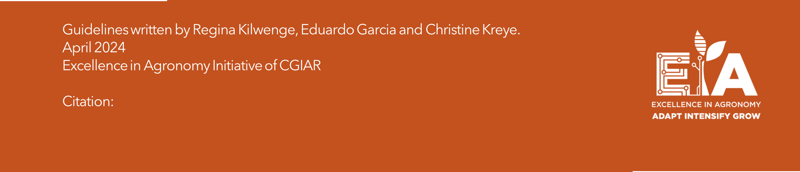

\newpage 
\pagenumbering{arabic}
\tableofcontents
\newpage


```{r setup, include=FALSE}
knitr::opts_chunk$set(echo = FALSE, warning=FALSE, comment = NA)
#\newpage
#\listoffigures
#\newpage
#\listoftables

```

# Introduction


```{r toc}

```

## gg

```{r intro , echo=FALSE}

```

\vfill
```{r pic ,out.width="100%", echo=FALSE}

```


